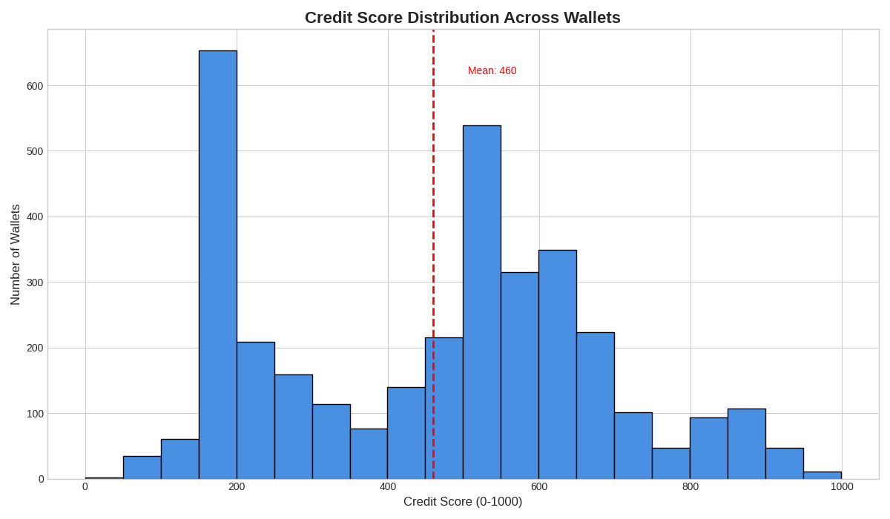

**Analysis of DeFi Wallet Credit Scores**

This document provides a detailed analysis of the credit scores assigned to 3,498 unique wallets based on their transaction history on the Aave V2 protocol. The scores were generated by the unsupervised, weighted model outlined in the main README.md.

The overall distribution of credit scores across all wallets is visualized below. The mean score is approximately 460, indicating that the majority of users in this dataset exhibit healthy or stable behavior. The distribution has a left skew, with a tail representing a smaller number of high-risk wallets.

**Score Distribution by Range**

To better understand the population, the scores were segmented into 100-point ranges. The table below shows the number of wallets that fall into each score bracket.

| Score Range | Number of Wallets |
|-------------|-------------------|
| 0-99        | 37                |
| 100-199     | 714               |
| 200-299     | 368               |
| 300-399     | 191               |
| 400-499     | 355               |
| 500-599     | 854               |
| 600-699     | 572               |
| 700-799     | 148               |
| 800-899     | 200               |
| 900-999     | 58                |

**Behavior of Wallets by Score Range**
 
__Low-Range Wallets (Score 0-400)__

Wallets in this lowest tier represent the highest risk to the protocol. Their behavior is characterized by one or more of the following traits:
 * Liquidation Events: The single most significant factor for a low score. Any wallet that has been liquidated receives a strong negative penalty, immediately placing it in this high-risk category. These users have failed to manage their debt-to-collateral ratio effectively.
 * Extremely Low Health Ratio: These wallets often borrow an amount that is very close to the value of their supplied collateral. They operate on the edge of liquidation, making them highly vulnerable to even minor market price fluctuations.
 * Minimal Capital with High-Risk Actions: Some wallets in this range may not have been liquidated but show signs of high-risk behavior with very little capital at stake. This could indicate testing, potential bot activity, or simply reckless borrowing without a significant financial commitment.
   
**Mid-Range Wallets (Score 400-700)**

This group represents the "average" DeFi user. They are generally stable but exhibit some behaviors that prevent them from achieving a top-tier score.
 * Moderate Health Ratios: These users maintain a safe but not exceptional collateral buffer. They are not in immediate danger of liquidation but could be at risk during a major market crash.
 * Incomplete Repayment History: Many wallets in this range have open borrows but have not yet demonstrated a strong history of repaying them. Their repayment_ratio is often low, not because they are delinquent, but because their borrowing lifecycle is still in progress.
 * Lower Capital Contribution: Often, these are smaller players who have deposited a modest amount of capital. While their ratios might be healthy, the model assigns a slightly lower score compared to wallets that have entrusted millions of a dollars to the protocol.
 * Lower Activity or Age: Wallets with a lower transaction_count or wallet_age_days may also fall into this category, as the model slightly favors more established and active users.
   
**High-Range Wallets (Score 700-1000)**

These are the ideal, top-tier users of the protocol. They are considered the most reliable and financially sound, contributing positively to the health of the Aave ecosystem.
 * Zero Liquidations: A perfect record with no liquidation events is a prerequisite for entering this tier.
 * Excellent Health & Repayment Ratios: These users either do not borrow at all (pure suppliers) or maintain exceptionally high health ratios. If they do borrow, they have a proven track record of repaying their loans, often reflected in a repayment_ratio close to or greater than 1.
 * Substantial Capital Deposited: The highest-scoring wallets are often "whales" who have supplied significant amounts of capital to the protocol. The total_deposited_usd feature gives them a boost, as it signals a high degree of trust and stability.
 * Established History: These wallets tend to have a longer history (wallet_age_days) and a higher number of transactions (transaction_count), indicating consistent and long-term engagement with the protocol.
 
